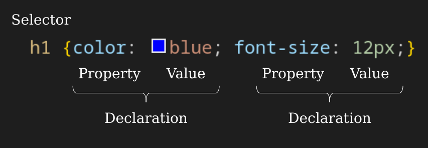
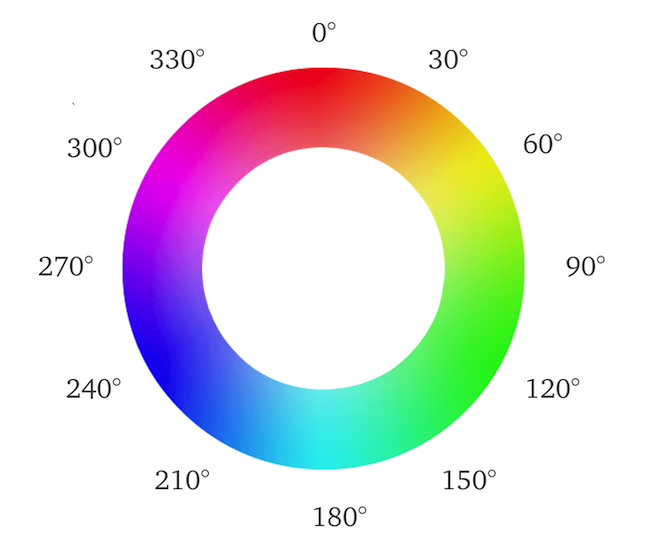

# Learn CSS

CSS is the language we use to style a Web page.

This course breaks down the fundamentals of CSS into digestible, easy to understand pieces. Over the next few modules, you'll learn how the core aspects of CSS work and how to use them effectively in your projects.

## CSS Introduction

### What is & Why use CSS?

- CSS stands for Cascading Style Sheets
- CSS describes how HTML elements are to be displayed on screen, paper, or in other media
- CSS can control the layout of multiple web pages all at once
- External stylesheets are stored in CSS files
- CSS is used to define styles for your web pages, including the design, layout and variations in display for different devices and screen sizes.

Bellow a very basic `CSS` example:

```css
body {
  background-color: lightblue;
}

h1 {
  color: brown;
  text-align: center;
}

p {
  font-family: Verdana, Geneva, Tahoma, sans-serif;
  font-size: 20px;
}
```

## CSS Syntax



The selector points to the HTML element you want to style.

The declaration block contains one or more declarations separated by semicolons.

Each declaration includes a CSS property name and a value, separated by a colon.

Multiple CSS declarations are separated with semicolons, and declaration blocks are surrounded by curly braces.

## CSS Selectors

CSS selectors are used to "find" (or select) the HTML elements you want to style. We can divide CSS selectors into five categories:

1. **Simple selectors:** select elements based on name, id, class
1. **Combinator selectors:** select elements based on a specific relationship between them
1. **Pseudo-class selectors:** select elements based on a certain state
1. **Pseudo-elements selectors:** select and style a part of an element
1. **Attribute selectors:** select elements based on an attribute or attribute value

### The CSS element Selector

The element selector selects HTML elements based on the element name.

```css
/* CSS element Selector */
h1 {
  color: darkblue;
}

h2 {
  color: cadetblue;
  text-align: center;
}
```

### The CSS id Selector

The id selector uses the `id` attribute of an `HTML` element to select a specific element. The `id` of an element is unique within a page, so the `id` selector is used to select one unique element!

To select an element with a specific `id`, write a hash (`#`) character, followed by the `id` of the element.

```css
/* CSS id Selector */
#blue_h2 {
  color: blue;
  font-family: "Courier New", Courier, monospace;
}

#red_para {
  color: red;
}
```

### The CSS class Selector

The class selector selects `HTML` elements with a specific class attribute.

To select elements with a specific class, write a period (`.`) character, followed by the class name.

```css
/* CSS class Selector */
.brown {
  color: brown;
}

p.brown {
  font-size: xx-large;
}
```

### The CSS Universal Selector

The universal selector (`*`) selects all HTML elements on the page.

```css
* {
  font-family: "Franklin Gothic Medium", "Arial Narrow", Arial, sans-serif;
}
```

### The CSS Grouping Selector

The grouping selector selects all the `HTML` elements with the same style definitions.

```css
/* CSS Grouping Selector */
h1,
h2,
p {
  font-size: medium;
}
```

## How to Insert CSS?

There are three ways of inserting a style sheet:

- External CSS
- Internal CSS
- Inline CSS

### External CSS

With an external style sheet `css` file

```shell
├── index.html
└── style.css
```

The `index.html` contains a link to the `css` file within the `head` tag

```html
<!DOCTYPE html>
<html lang="en">
  <head>
    <meta charset="UTF-8" />
    <meta http-equiv="X-UA-Compatible" content="IE=edge" />
    <meta name="viewport" content="width=device-width, initial-scale=1.0" />
    <title>Learn CSS - 004 How to insert CSS?</title>

    <!-- My Stylesheet File -->
    <link rel="stylesheet" type="text/css" href="./style.css" />
  </head>

  <body>
    <h1>How to insert CSS?</h1>

    <h2>External CSS</h2>

    <p class="external_css">
      This paragraph was styled using an external CSS file
    </p>
  </body>
</html>
```

The `style.css` contains therefore

```css
.external_css {
  color: blue;
  font-family: Arial, "Helvetica Neue", Helvetica, sans-serif;
}
```

### Internal CSS

The internal style is defined inside the `<style>` element, inside the head section.

```html
<!DOCTYPE html>
<html lang="en">
  <head>
    <meta charset="UTF-8" />
    <meta http-equiv="X-UA-Compatible" content="IE=edge" />
    <meta name="viewport" content="width=device-width, initial-scale=1.0" />
    <title>Learn CSS - 004 How to insert CSS?</title>

    <!-- My Stylesheet File -->
    <link rel="stylesheet" type="text/css" href="./style.css" />

    <!-- Internal CSS -->
    <style>
      .internal_css {
        color: red;
        font-size: 25px;
        background-color: aquamarine;
      }
    </style>
  </head>

  <body>
    <h1>How to insert CSS?</h1>

    <h2>External CSS</h2>

    <p class="external_css">
      This paragraph was styled using an external CSS file
    </p>

    <h2>Internal CSS</h2>

    <p class="internal_css">
      For this paragraph an internal css was used to change its style
    </p>
  </body>
</html>
```

### Inline CSS

To use inline styles, add the style attribute to the relevant element. The style attribute can contain any CSS property.

```html
<!DOCTYPE html>
<html lang="en">
  <head>
    <meta charset="UTF-8" />
    <meta http-equiv="X-UA-Compatible" content="IE=edge" />
    <meta name="viewport" content="width=device-width, initial-scale=1.0" />
    <title>Learn CSS - 004 How to insert CSS?</title>

    <!-- My Stylesheet File -->
    <link rel="stylesheet" type="text/css" href="./style.css" />

    <!-- Internal CSS -->
    <style>
      .internal_css {
        color: red;
        font-size: 25px;
        background-color: aquamarine;
      }
    </style>
  </head>

  <body>
    <h1>How to insert CSS?</h1>

    <h2>External CSS</h2>

    <p class="external_css">
      This paragraph was styled using an external CSS file
    </p>

    <h2>Internal CSS</h2>

    <p class="internal_css">
      For this paragraph an internal css was used to change its style
    </p>

    <h2>Inline CSS</h2>

    <p style="color: blueviolet; text-align: center;">
      Finally for this paragraph, the inline css was used for the styling
    </p>
  </body>
</html>
```

## CSS Colors

Colors can be used under CSS using (i) predefined color names, (ii) RGB, (iii) HEX, (iv) HSL, (v) RGBA, or (vi) HSLA values.

### CSS Color Names

In CSS, a color can be specified by its predefined color name. The following [link](https://www.w3.org/wiki/CSS/Properties/color/keywords) includes the list of these colors.

### CSS Background Color

We can set the background color for HTML elements using the `background-color` css property

```html
<div class="basic" style="background-color: lime;">lime</div>
<p style="background-color:red;">Here is my paragraph...</p>
```

### CSS Text Color

We can set the color of text using the `color` css property

```html
<h1 style="color: blue;">Hello World</h1>
<p style="color: fuchsia;">Lorem ipsum...</p>
<p style="color: aqua;">Lorem ipsum...</p>
```

### CSS Border Color

We can set the border color for HTML elements using the `border` css property

```html
<h1 style="border:2px solid Tomato;">Hello World</h1>
<h1 style="border:2px solid DodgerBlue;">Hello World</h1>
<h1 style="border:2px solid Violet;">Hello World</h1>
```

### CSS Color Values

In CSS, colors can also be specified using RGB values, HEX values, HSL values, RGBA values, and HSLA values.

#### RGB & RGBA Value

An RGB color value represents RED, GREEN, and BLUE light sources. In CSS, a color can be specified as an RGB value, using this formula: `rgb(red, green, blue)`. RGBA color values are an extension of RGB color values with an alpha channel - which specifies the opacity for a color. An RGBA color value is specified with: `rgba(red, green, blue, alpha)`. The alpha parameter is a number between 0.0 (fully transparent) and 1.0 (not transparent at all).

#### HEX & 3 Digit HEX Value

A hexadecimal color is specified with: #RRGGBB, where the RR (red), GG (green) and BB (blue) hexadecimal integers specify the components of the color. In CSS, a color can be specified using a hexadecimal value in the form: `#rrggbb` where `rr` (red), `gg` (green) and `bb` (blue) are hexadecimal values between `00` and `ff` (same as decimal 0-255).

For example, `#ff0000` is displayed as red, because red is set to its highest value (`ff`) and the others are set to the lowest value (`00`).

The _3-digit_ hex code is a shorthand for some _6-digit_ hex codes. The _3-digit_ hex code has the following form: `#rgb` where `r`, `g`, and `b` represent the red, green, and blue components with values between `0` and `f`.

#### HSL & HSLA Value

HSL stands for hue, saturation, and lightness. In `CSS`, a color can be specified using hue, saturation, and lightness (HSL) in the form: `hsl(hue, saturation, lightness)`.

- Hue is a degree on the color wheel from 0 to 360. 0 is red, 120 is green, and 240 is blue.
- Saturation is a percentage value. 0% means a shade of gray, and 100% is the full color.
- Lightness is also a percentage. 0% is black, 50% is neither light or dark, 100% is white



HSLA color values are an extension of HSL color values with an alpha channel - which specifies the opacity for a color. An HSLA color value is specified with: `hsla(hue, saturation, lightness, alpha)`. The alpha parameter is a number between 0.0 (fully transparent) and 1.0 (not transparent at all).

#### CSS Color Examples

```html
<h1 style="background-color: rgb(255, 99, 71);">rgb(255, 99, 71)</h1>
<h1 style="background-color: #ff6347;">#ff6347</h1>
<h1 style="background-color: hsl(9, 100%, 64%);">hsl(9, 100%, 64%)</h1>
```

Same as color name, but 50% transparent:

```html
<h1 style="background-color: rgba(255, 99, 71, 0.5);">
  rgba(255, 99, 71, 0.5)
</h1>
<h1 style="background-color: hsla(9, 100%, 64%, 0.5);">
  hsla(9, 100%, 64%, 0.5)
</h1>
```

```css
body {
  background-color: #bf2; /* same as #bbff22 */
}

h1 {
  color: #00f; /* same as #0000ff */
}

p {
  color: #c79; /* same as #cc7799 */
}
```
